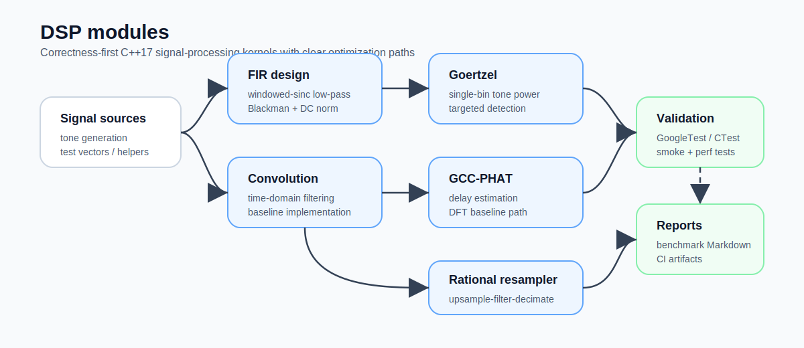
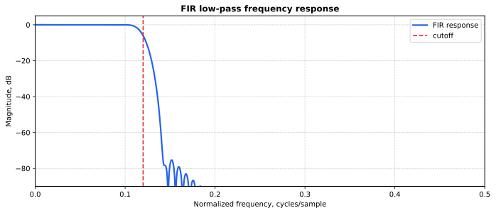
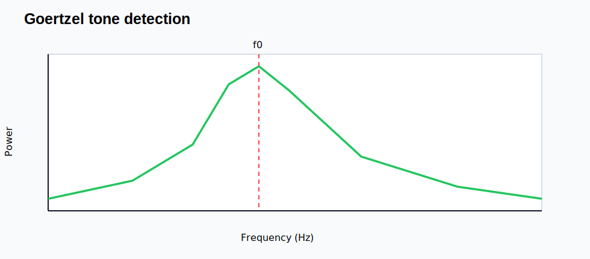
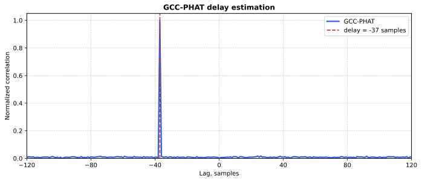
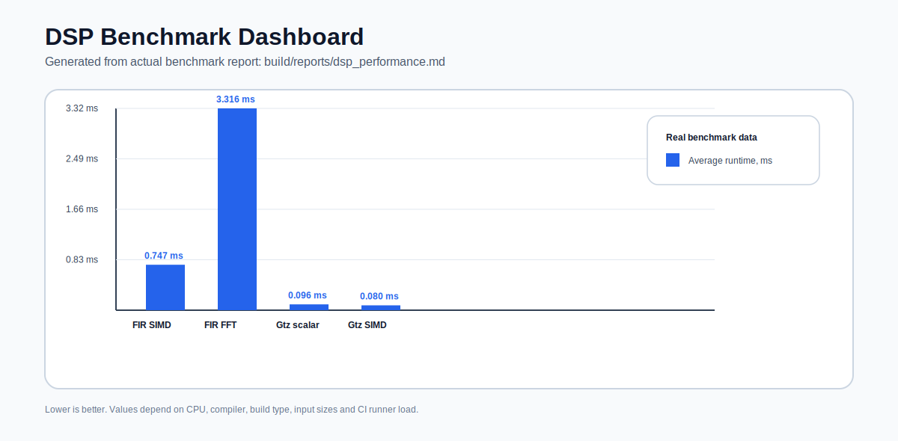

# cpp-dsp-showcase

[](#)
[](#)
[](https://github.com/Lay007/cpp-dsp-showcase/actions/workflows/cmake-multi-platform.yml)
[](LICENSE)

---

## 🚀 DSP engineering showcase + SDR course backend

```text
Signal → SDR → IQ → C++ DSP → analysis → benchmark → FPGA candidate
```

---

## 📚 Lab track

See: `docs/labs/README.md`

---

## 🧩 DSP modules



---

## 📊 Visual DSP artifacts

### FIR response


### Goertzel detection


### GCC-PHAT delay


---

## 📊 Performance dashboard



👉 Full report: `docs/benchmark.md`

---

## 🚀 Quick start

```bash
cmake -S . -B build -DDSP_ENABLE_AVX2=ON -DCMAKE_BUILD_TYPE=Release
cmake --build build
cmake --build build --target benchmark_report
```

---

## 🧭 Engineering roadmap

- SIMD / AVX optimization
- FFT-based acceleration
- SDR streaming
- FPGA mapping

---

## 📄 License

MIT
